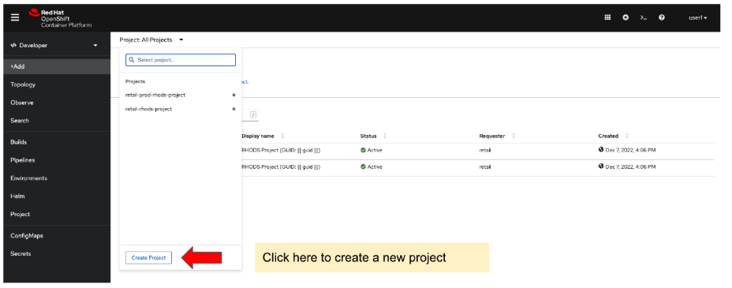
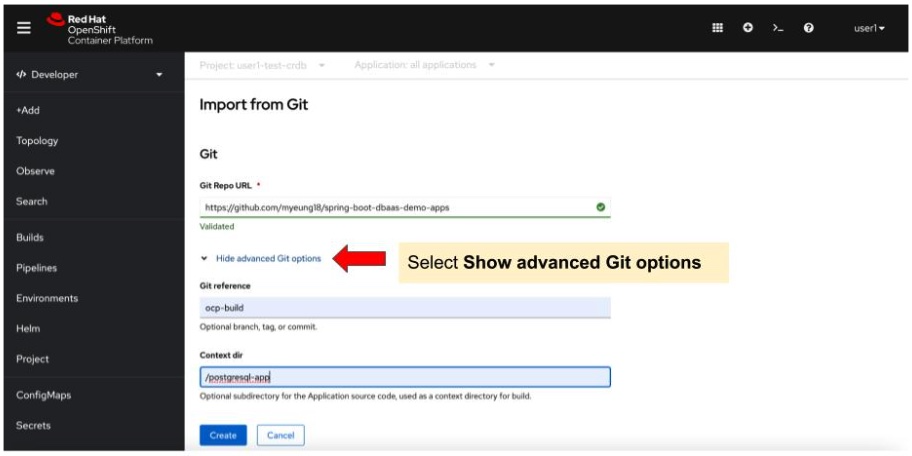
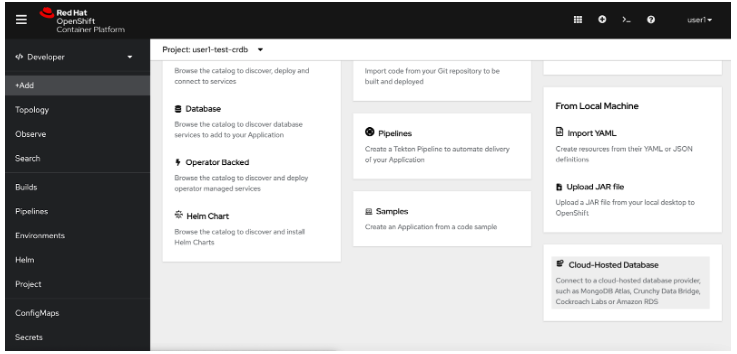

:guid: %guid%
:user: %user%
:markup-in-source: verbatim,attributes,quotes

. Login to the OpenShift console using User1 credentials (login = user1 / password = openshift).
On the OpenShift console under the Developer perspective, create a new project called user1-crdb-test.
+

+
. On the OpenShift console left-side menu, select +Add and the Import from Git tile. Fill the following Git fields:
.. Git Repo URL = https://github.com/myeung18/spring-boot-dbaas-demo-apps
.. Git reference = ocp-build
.. Context dir = /postgresql-app
. Use the default values for the other fields and Create the application.
+

+
. Building the application pod will take approximately 30 seconds. Once the pod starts running, it will keep restarting till it finds a valid database connection.
+
On the OpenShift console left-side menu, select +Add and the Cloud Hosted Databases tile. Choose CockroachDB tile and select the database instance that you want to use. You will see that a database connection instance has been added to the Topology view of your project.
+

+
